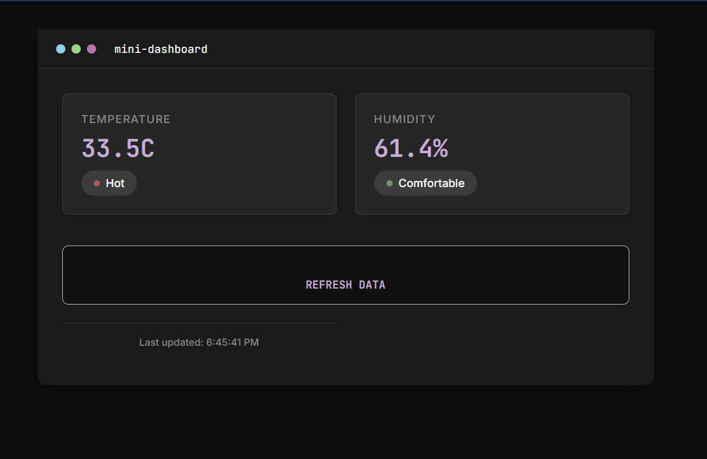

# esp32-dht 
simulation d'un système intelligent de surveillance de temperature et humidité et affichage des resultats dans dashboard web et cloud

<b> Captures d'écran : </b> 

<b>Fonctionnalités : </b> 
- Dashboard web local
- Synchronisation cloud beebotte
- Données temps réel
- API REST
  
<b>Technologies : </b> 
- Microcontroleur : esp32
- backend : C++ (Arduino)
- frontend : HTML / CSS / JS
- cloud : Beebotte
- protocoles : HTTP , REST API
